 

### Introduction

Backend engineer focused on designing and shipping production systems — REST and event-driven APIs, service-to-service auth, and the data layer underneath them. Comfortable owning a feature from schema to deployment. Recent work sits at the intersection of backend infrastructure and applied AI: retrieval pipelines, agent tooling, and context-aware services built on LangChain, LangGraph, and MCP. I optimize for systems that are boring to operate — predictable, observable, and easy to roll back.

### Engineering Philosophy

<table>
<tr>
<td width="50%" valign="top">

**Correctness before cleverness**
Code is read far more than it is written. I favor explicit types, small functions, and interfaces that fail loudly in development rather than silently in production.

**Design for the failure case**
Timeouts, retries, idempotency, and backpressure are not edge cases — they are the actual system. I design the failure path first, then the happy path.

</td>
<td width="50%" valign="top">

**Scale is a budget, not a feature**
Premature horizontal scaling costs more than it saves. I profile before I shard, and I reach for caching, indexing, and query design before infrastructure.

**Developer experience compounds**
Fast local setup, typed contracts, and CI that catches regressions early are what let a team move quickly six months in, not just in week one.

</td>
</tr>
</table>

### Core Expertise

<table>
<tr>
<td width="80" align="center"></td>
<td valign="middle">

**Backend Engineering**
REST and RPC API design, authentication and authorization (JWT, OAuth2), service architecture, request validation, rate limiting, and background job processing with Node.js, Fastify, and Express.

</td>
</tr>
<tr>
<td width="80" align="center"></td>
<td valign="middle">

**AI Engineering**
RAG pipelines, agentic workflows with LangChain and LangGraph, Model Context Protocol integrations, embedding generation, and retrieval over Qdrant and PGVector.

</td>
</tr>
<tr>
<td width="80" align="center"></td>
<td valign="middle">

**Cloud & Systems Design**
Containerized deployments with Docker, CI/CD via GitHub Actions, AWS-hosted services, database schema design across PostgreSQL and MongoDB, Redis for caching and queues, and microservice decomposition.

</td>
</tr>
</table>

### Technology Stack

**Languages**

**Backend**

**Frontend**

**Databases**

**Cloud & DevOps**

**AI & Vector Search**

**Tools**

### Current Focus

- Building production-grade MCP servers to expose internal tools and data sources to LLM agents
- Deepening system design fundamentals — consistency models, partitioning strategies, and queue-based architectures
- Extending a Fastify service template with built-in observability, structured logging, and typed request contracts
- Working through advanced graph and dynamic programming problems on LeetCode

### GitHub Stats

 

 

  

### LeetCode

<table>
<tr>
<td align="center" width="180"><h3>150+</h3>Problems Solved</td>
<td align="center" width="180"><h3>Java</h3>Primary Language</td>
<td align="center" width="180"><h3>DSA</h3>Focus Area</td>
</tr>
</table>

Consistent practice in data structures, algorithms, and graph problems — with an emphasis on reasoning through time and space complexity before writing code.

### Connect

<table width="100%">
<tr>
<td width="25%" align="center">

**Portfolio**
[rajesh-kayal-portfolio.vercel.app](https://rajesh-kayal-portfolio.vercel.app/)

</td>
<td width="25%" align="center">

**LinkedIn**
[in/rajesh110](https://www.linkedin.com/in/rajesh110/)

</td>
<td width="25%" align="center">

**X**
[@RajeshKayal_](https://x.com/RajeshKayal_)

</td>
<td width="25%" align="center">

**GitHub**
[@rajesh-kayal-dev](https://github.com/rajesh-kayal-dev/)

</td>
</tr>
</table>

 

 

