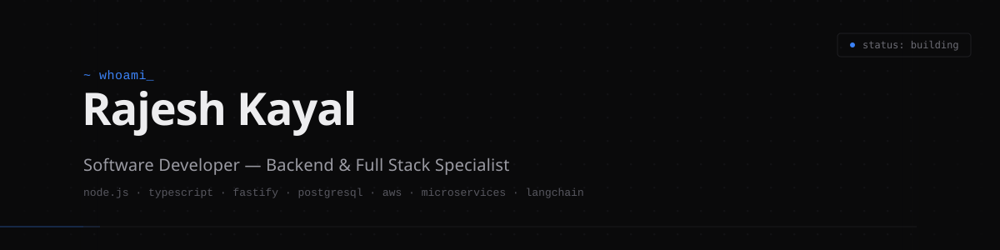

 

### Introduction

Most users only see a button. I love building what happens after they click it.

That curiosity turned me into a **Full Stack Developer** with 1+ year of experience. I build fast, secure and scalable products that go live and are built to handle real users.

My main stack is **React, Node.js, TypeScript, PostgreSQL, Kafka, Docker and AWS**, with a focus on **Cloud & DevOps** and hands-on experience in **microservices architecture**.

I enjoy turning complex problems into simple, clean systems that can grow with the product. Always open to connect and build impactful products.

### Technology Stack

**Languages** &nbsp;

**Frontend** &nbsp;

**Backend** &nbsp;

**Databases** &nbsp;

**Cloud & DevOps** &nbsp;

**AI** &nbsp;

### GitHub Stats

 

 

  

 

